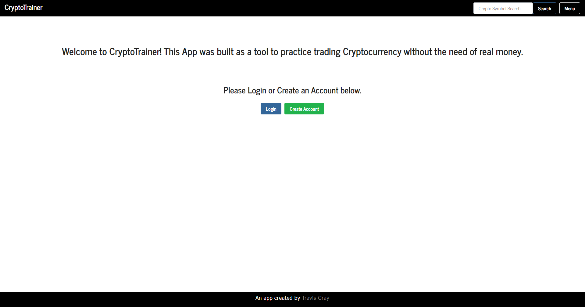
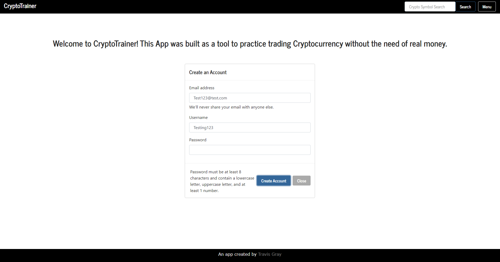
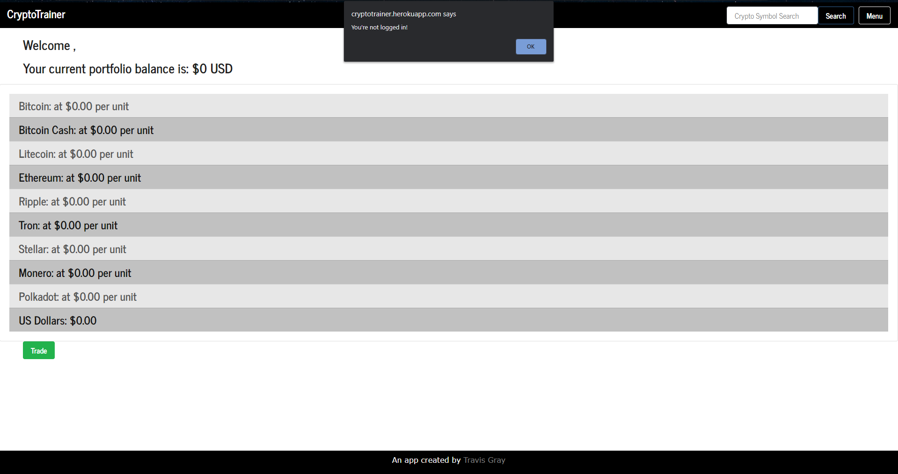
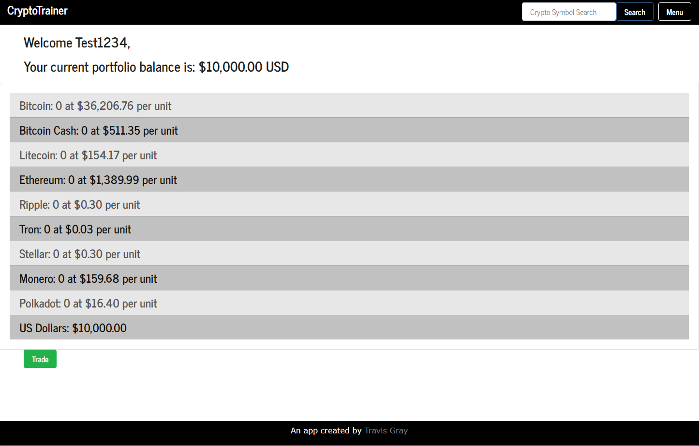
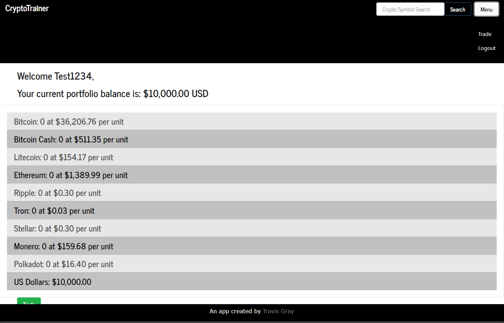
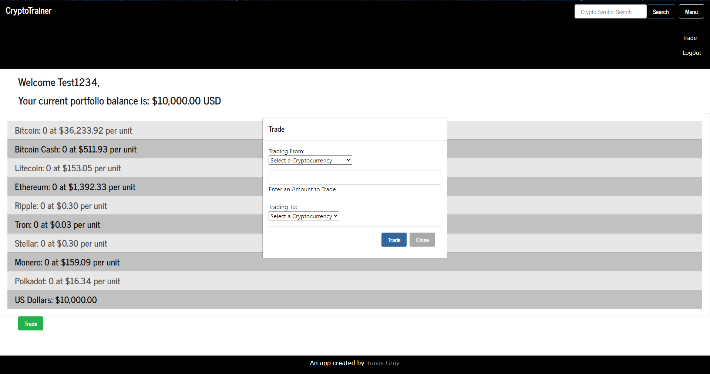
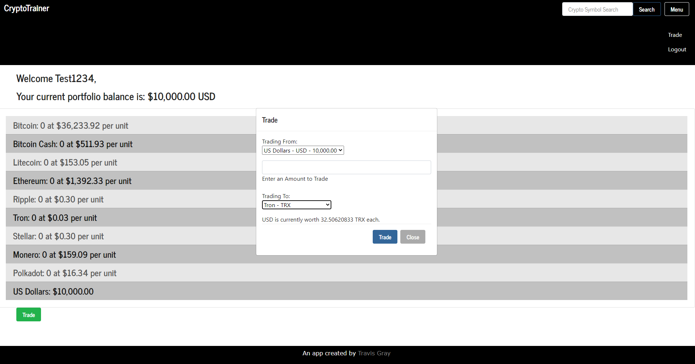
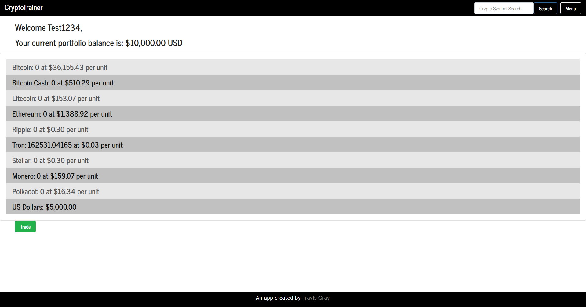
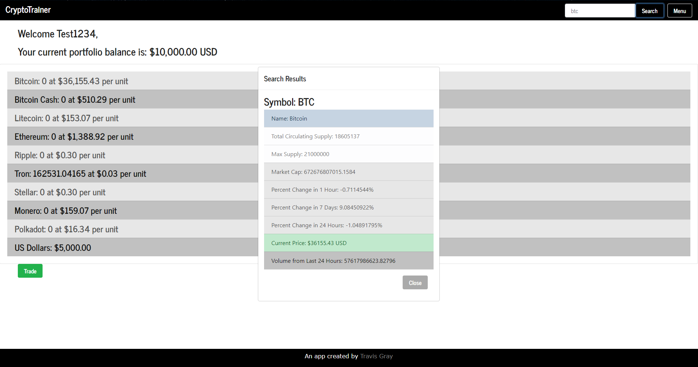

# CryptoTrainer

## By Travis Gray

Welcome to my final project for my Bootcamp course at the University of Utah! I have come such as long way since the beginning and this project really tested my skill to put together a fully functional app. Although I didn't have much time to do it, I'm quite impressed at how well it came together.

This project was about 90% coding and 10% deploying it after I was finished!

## Introduction

If you've ever been interested in trading cryptocurrencies, which is similar to trading stocks, but didn't have a platform to use and test your skill. This is where Cryptotrainer comes into play. It's a tool that gives you a portfolio when you create an account, with a starting capital of $10,000. This isn't real money and the cryptocurrencies you're trading using this tool aren't really being traded, it's just to help you track a portfolio while you learn to trade cryptocurrencies and read the market. You can also do a symbol lookup and get information displayed to you about that cryptocurrency.

## User Story

As someone that wants to learn how to trade cryptocurrencies,
I want a tool that will help me monitor progress without the need of real money,
So that I can gain knowledge, track progress, and eventually make a profit when I perform real trading in the future.

## Instructional Guide

Upon first loading the webpage, you will be greeted with the "_Landing_" page and given a short message about the site.

The navbar at the top has a functional search box to search for any cryptocurrency using its symbol. You'll probably need to do a symbol lookup first unless you already know it.

The navbar also has a menu button on the right that changes depending on the page you're currently on. On the _Landing_ page, it will display the two options "_Login_" and "_Create an Account_".

If you haven't created an account, you can click the Create Account button on the main page or click on the Menu button at the top right and select Create Account.

If you select either option, you will be shown a popup with the related information to login or create an account with a few fields to fill out. When creating an account, the populated fields will be checked against the user database to see if the email or username is already taken. If the username and email aren't taken, your password will be checked to verify that it meets the criteria of:
* At least 8 characters
* At least 1 uppercase letter
* At least 1 lowercase letter
* At least 1 number
If it doesn't meet this criteria, it will display a message saying so. Once everything is good to go, it will display a message, create your new account and portfolio, and take you to the _Dashboard_ menu.

If you attempt to login and you get either your username or password incorrect, a message will be displayed saying so but won't specify which one is incorrect. When your credentials are correct, it will display a message and take you to the _Dashboard_ menu.

If you're creating an account, the password is encrypted by the "_bcrypt_" package and then the hash is stored in the DB. When you try to log in, it takes your password, hashes it, and then verifies if it matches in the DB.

If you attempt to access the _Dashboard_ screen without being logged in first, an alert message will pop up and tell you to please log in first. No account info will be displayed on the main page, and you will be redirected to the _Landing_ page.

Upon successfully logging in, you will be see the Dashboard screen where it will display your current portfolio values and the values of each cryptocurrency in USD. Here you can track your day to day values and then when you're ready to make a "trade" from one cryptocurrency to another, or cryptocurrency to USD, you can click the "_Trade_" button at the bottom or select Menu at the top and select _Trade_.

When the trade modal displays, here you can select the cryptocurrency that you're trading from, an amount you'd like to trade of that cryptocurreny, and then the cryptocurrency you're going to be converting to including USD. Once the two cryptocurrencies are selected, you will be shown a message at the bottom of the modal that shows the conversion value from the previous cryptocurrency to the new cryptocurrency. There are a few safeguards in place to prevent any bad API calls such as selecting the same cryptocurrency or selecting the default menu option. 

After you've entered in your desired amounts, you can select the "_Trade_" option and then if successful, a success message will display and the modal will close. The dashboard page will reflect the new amounts on your Portfolio page. If you attempt to use more currency than you have available and then try to select the _Trade_ option, an error message will display.

I've also added a screenshot of the symbol search functionality. When you type in a 3 character symbol such as _BTC_ for bitcoin, and press search. A modal will pop up and display some detailed information about the Cryptocurrency.

If you'd like to log out of your account, you can press the menu option at the top and select "_Logout_". This will destroy your current session and you won't be able to access your Portfolio on the Dashboard until you log in again.

## Future Development

With the short amount of time that I had to work on this project, there were a lot more plans that I was never able to get to. I had installed some packages that I never used but I plan on integrating them when I work on this in the future.

My package list:

* Axios
* bcrypt
* Body-Parser
* Connect-MongoDB-Session - Used because I was using the regular "Express Session" and was getting memory leak errors.
* Express
* Express-Session
* JSON Web Token - I was thinking about using this but I was never able to get to it.
* Mongoose
* Nodemailer - I was going to use this to email you a welcome message once you create an account but was never able to get to it.
* Passport - I was trying to figure out how this works but ended up just coding everything myself.
* Recharts - I was going to use this to display chart information for day to day portfolio values.
* Regex
* Socket.io - I was going to use this in place of the messages that pop up in the modals but couldn't get to it in time.

I have plans to add a settings page, add charts, add more cryptocurrencies since there's hundreds to choose from, and add more functionality in general.

